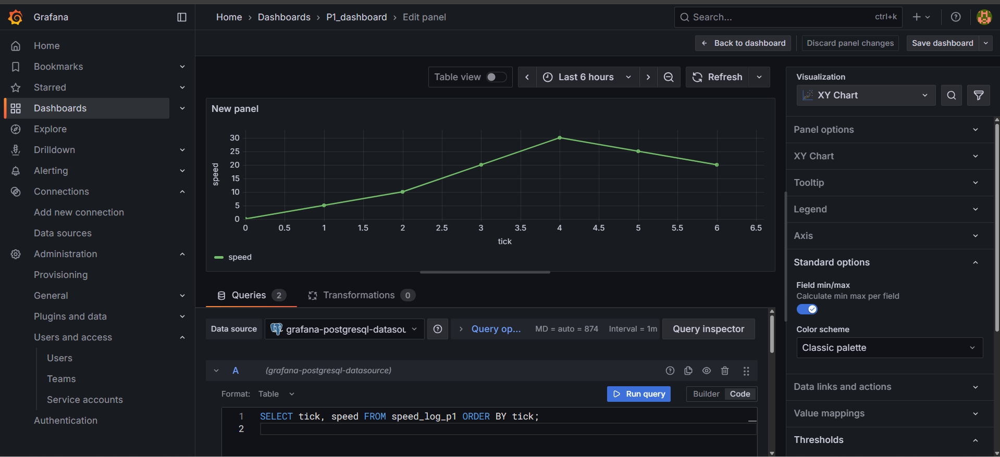

## Objective

The objective of this problem is to implement and simulate the SetSpeed component from Rajeev Alur’s Principles of Cyber-Physical Systems. The task is to model the speed-adjustment logic in Heptagon, compile it to C, execute the simulation, store the results in PostgreSQL, and visualize the speed evolution in Grafana.

-----

## Heptagon Model (setspeed.ept)

```heptagon
node setspeed(cmd: int; accel: int; decel: int) 
returns (speed: int)
var
  prev_speed: int;
  delta: int;
let
  prev_speed = 0 -> pre speed;

  delta =
    if prev_speed < cmd then
      (if cmd - prev_speed < accel then cmd - prev_speed else accel)
    else if prev_speed > cmd then
      (if prev_speed - cmd < decel then -(prev_speed - cmd) else -decel)
    else 0;

  speed = prev_speed + delta;

tel

node main(cmd_in: int; accel_in: int; decel_in: int)
returns (speed_out: int)
let
  speed_out = setspeed(cmd_in, accel_in, decel_in);
tel
```

-----

## Generated Code (setspeed.c, setspeed.h)

### setspeed.c

```c
/* --- Generated the 16/11/2025 at 6:59 --- */
/* --- heptagon compiler, version 1.05.00 (compiled sat. nov. 1 5:25:8 CET 2025) --- */
/* --- Command line: /usr/local/bin/heptc setspeed.ept -target c -targetpath ./setspeedc --- */

#include <stdio.h>
#include <string.h>
#include <stdlib.h>
#include "setspeed.h"

void Setspeed__setspeed_reset(Setspeed__setspeed_mem* self) {
  self->v = true;
}

void Setspeed__setspeed_step(int cmd, int accel, int decel,
                             Setspeed__setspeed_out* _out,
                             Setspeed__setspeed_mem* self) {
  
  int v_14;
  int v_13;
  int v_12;
  int v_11;
  int v_10;
  int v_9;
  int v_8;
  int v_7;
  int v_6;
  int v_5;
  int v_4;
  int v_3;
  int v_2;
  int prev_speed;
  int delta;
  v_12 = -(decel);
  if (self->v) {
    prev_speed = 0;
  } else {
    prev_speed = self->v_1;
  };
  v_10 = (prev_speed-cmd);
  v_11 = -(v_10);
  v_8 = (prev_speed-cmd);
  v_9 = (v_8<decel);
  if (v_9) {
    v_13 = v_11;
  } else {
    v_13 = v_12;
  };
  v_7 = (prev_speed>cmd);
  if (v_7) {
    v_14 = v_13;
  } else {
    v_14 = 0;
  };
  v_5 = (cmd-prev_speed);
  v_3 = (cmd-prev_speed);
  v_4 = (v_3<accel);
  if (v_4) {
    v_6 = v_5;
  } else {
    v_6 = accel;
  };
  v_2 = (prev_speed<cmd);
  if (v_2) {
    delta = v_6;
  } else {
    delta = v_14;
  };
  _out->speed = (prev_speed+delta);
  self->v_1 = _out->speed;
  self->v = false;;
}

void Setspeed__main_reset(Setspeed__main_mem* self) {
  Setspeed__setspeed_reset(&self->setspeed);
}

void Setspeed__main_step(int cmd_in, int accel_in, int decel_in,
                         Setspeed__main_out* _out, Setspeed__main_mem* self) {
  Setspeed__setspeed_out Setspeed__setspeed_out_st;
  Setspeed__setspeed_step(cmd_in, accel_in, decel_in,
                          &Setspeed__setspeed_out_st, &self->setspeed);
  _out->speed_out = Setspeed__setspeed_out_st.speed;
}
```

### setspeed.h

```c
/* --- Generated the 16/11/2025 at 6:59 --- */
/* --- heptagon compiler, version 1.05.00 (compiled sat. nov. 1 5:25:8 CET 2025) --- */
/* --- Command line: /usr/local/bin/heptc setspeed.ept -target c -targetpath ./setspeedc --- */

#ifndef SETSPEED_H
#define SETSPEED_H

#include "setspeed_types.h"
typedef struct Setspeed__setspeed_mem {
  int v_1;
  int v;
} Setspeed__setspeed_mem;

typedef struct Setspeed__setspeed_out {
  int speed;
} Setspeed__setspeed_out;

void Setspeed__setspeed_reset(Setspeed__setspeed_mem* self);

void Setspeed__setspeed_step(int cmd, int accel, int decel,
                             Setspeed__setspeed_out* _out,
                             Setspeed__setspeed_mem* self);

typedef struct Setspeed__main_mem {
  Setspeed__setspeed_mem setspeed;
} Setspeed__main_mem;

typedef struct Setspeed__main_out {
  int speed_out;
} Setspeed__main_out;

void Setspeed__main_reset(Setspeed__main_mem* self);

void Setspeed__main_step(int cmd_in, int accel_in, int decel_in,
                         Setspeed__main_out* _out, Setspeed__main_mem* self);

#endif // SETSPEED_H
```

-----

## Wrapper File (setspeed\_wrapper.c)

```c
#include "setspeed_types.h"
#include "setspeed.h"

// Global memory for the setspeed node
static Setspeed__setspeed_mem ss_mem;

// Initialize the node
void setspeed_init() {
    Setspeed__setspeed_reset(&ss_mem);
}

// One computation step
int setspeed_step(int cmd, int accel, int decel) {
    Setspeed__setspeed_out out;
    Setspeed__setspeed_step(cmd, accel, decel, &out, &ss_mem);
    return out.speed;
}
```

-----

## Simulation Driver (main\_sim.c)

```c
#include <stdio.h>
#include <stdlib.h>
#include <string.h>

void setspeed_init();
int setspeed_step(int cmd, int accel, int decel);

int main(int argc, char **argv) {

    const char *infile = (argc >= 2) ? argv[1] : "input.csv";
    const char *outfile = (argc >= 3) ? argv[2] : "output.csv";

    FILE *fin = fopen(infile, "r");
    if (!fin) {
        perror("Error opening input.csv");
        return 1;
    }

    FILE *fout = fopen(outfile, "w");
    if (!fout) {
        perror("Error opening output.csv");
        fclose(fin);
        return 1;
    }

    fprintf(fout, "tick,cmd,accel,decel,speed\n");

    setspeed_init();

    int tick = 0;
    char line[256];

    while (fgets(line, sizeof(line), fin)) {
        if (line[0] == '#' || strlen(line) < 3)
            continue;

        int cmd, accel, decel;
        if (sscanf(line, "%d,%d,%d", &cmd, &accel, &decel) != 3)
            continue;

        int speed = setspeed_step(cmd, accel, decel);

        fprintf(fout, "%d,%d,%d,%d,%d\n",
                tick, cmd, accel, decel, speed);

        tick++;
    }

    fclose(fin);
    fclose(fout);

    return 0;
}
```

-----

## Input File (input.csv)

```csv
# cmd,accel,decel
0,5,5
20,5,5
20,5,5
50,10,10
50,10,10
10,5,5
0,5,5
```

-----

## Output File (output.csv)

```csv
tick,cmd,accel,decel,speed
0,0,5,5,0
1,20,5,5,5
2,20,5,5,10
3,50,10,10,20
4,50,10,10,30
5,10,5,5,25
6,0,5,5,20
```

-----

## PostgreSQL Table Schema

| Column Name | Data Type | Constraints |
| :--- | :--- | :--- |
| tick | INT | |
| cmd | INT | |
| accel | INT | |
| decel | INT | |
| speed | INT | |

-----

## Python Insert Script (insert\_output\_to\_postgres.py)

```python
import psycopg2
import csv
import sys

csvfile = sys.argv[1] if len(sys.argv) > 1 else "output.csv"
table = "speed_log_p1"

conn = psycopg2.connect(
    dbname="mydb",
    user="amank",
    password="aman123",
    host="localhost",
    port=5432
)

cur = conn.cursor()

create_sql = """
CREATE TABLE IF NOT EXISTS speed_log_p1(
    tick INT,
    cmd INT,
    accel INT,
    decel INT,
    speed INT
);
"""

cur.execute(create_sql)
conn.commit()

with open(csvfile) as f:
    dr = csv.DictReader(f)
    for row in dr:
        cur.execute(
            "INSERT INTO speed_log_p1 (tick, cmd, accel, decel, speed) VALUES (%s,%s,%s,%s,%s)",
            (row['tick'], row['cmd'], row['accel'], row['decel'], row['speed'])
        )

conn.commit()
cur.close()
conn.close()

print("Inserted rows from", csvfile)
```

-----

## Grafana Screenshot

-----


