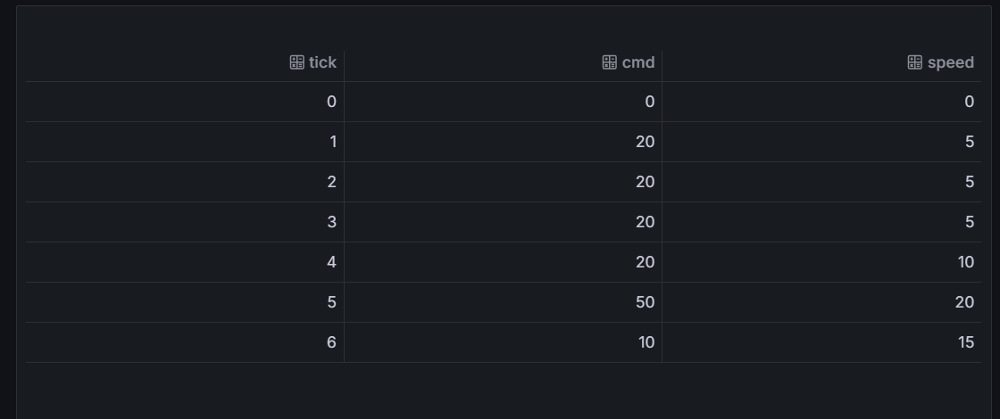

## Objective

The objective of this problem is to extend the SetSpeed component by incorporating the pause behavior defined in Exercise 2.21. The updated component must be modeled in Heptagon, simulated for different command and pause inputs, logged into PostgreSQL, and visualized in Grafana to analyze its behavior.

-----

## Heptagon Model (updated_setspeed.ept)

```heptagon
node updated_setspeed(cmd: int; accel: int; decel: int; pause: bool)
returns (speed: int; effective_delta: int)
var
  prev_speed: int;
  delta: int;
let
  prev_speed = 0 -> pre speed;

  -- When paused: speed does not change
  delta =
    if pause then
      0
    else if prev_speed < cmd then
      (if cmd - prev_speed < accel then cmd - prev_speed else accel)
    else if prev_speed > cmd then
      (if prev_speed - cmd < decel then -(prev_speed - cmd) else -decel)
    else
      0;

  speed = prev_speed + delta;
  effective_delta = delta;
tel

node main(cmd_in: int; accel_in: int; decel_in: int; pause_in: bool)
returns (speed_out: int; delta_out: int)
let
  (speed_out, delta_out) = updated_setspeed(cmd_in, accel_in, decel_in, pause_in);
tel

```

-----

## Generated Code (setspeed.c, setspeed.h)

### updated_setspeed.c

```c
/* --- Generated the 16/11/2025 at 9:35 --- */
/* --- heptagon compiler, version 1.05.00 (compiled sat. nov. 1 5:25:8 CET 2025) --- */
/* --- Command line: /usr/local/bin/heptc updated_setspeed.ept -target c -targetpath ./updated_setspeedc --- */

#include <stdio.h>
#include <string.h>
#include <stdlib.h>
#include "updated_setspeed.h"

void Updated_setspeed__updated_setspeed_reset(Updated_setspeed__updated_setspeed_mem* self) {
  self->v = true;
}

void Updated_setspeed__updated_setspeed_step(int cmd, int accel, int decel,
                                             int pause,
                                             Updated_setspeed__updated_setspeed_out* _out,
                                             Updated_setspeed__updated_setspeed_mem* self) {
  
  int v_15;
  int v_14;
  int v_13;
  int v_12;
  int v_11;
  int v_10;
  int v_9;
  int v_8;
  int v_7;
  int v_6;
  int v_5;
  int v_4;
  int v_3;
  int v_2;
  int prev_speed;
  int delta;
  v_12 = -(decel);
  if (self->v) {
    prev_speed = 0;
  } else {
    prev_speed = self->v_1;
  };
  v_10 = (prev_speed-cmd);
  v_11 = -(v_10);
  v_8 = (prev_speed-cmd);
  v_9 = (v_8<decel);
  if (v_9) {
    v_13 = v_11;
  } else {
    v_13 = v_12;
  };
  v_7 = (prev_speed>cmd);
  if (v_7) {
    v_14 = v_13;
  } else {
    v_14 = 0;
  };
  v_5 = (cmd-prev_speed);
  v_3 = (cmd-prev_speed);
  v_4 = (v_3<accel);
  if (v_4) {
    v_6 = v_5;
  } else {
    v_6 = accel;
  };
  v_2 = (prev_speed<cmd);
  if (v_2) {
    v_15 = v_6;
  } else {
    v_15 = v_14;
  };
  if (pause) {
    delta = 0;
  } else {
    delta = v_15;
  };
  _out->effective_delta = delta;
  _out->speed = (prev_speed+delta);
  self->v_1 = _out->speed;
  self->v = false;;
}

void Updated_setspeed__main_reset(Updated_setspeed__main_mem* self) {
  Updated_setspeed__updated_setspeed_reset(&self->updated_setspeed);
}

void Updated_setspeed__main_step(int cmd_in, int accel_in, int decel_in,
                                 int pause_in,
                                 Updated_setspeed__main_out* _out,
                                 Updated_setspeed__main_mem* self) {
  Updated_setspeed__updated_setspeed_out Updated_setspeed__updated_setspeed_out_st;
  Updated_setspeed__updated_setspeed_step(cmd_in, accel_in, decel_in,
                                          pause_in,
                                          &Updated_setspeed__updated_setspeed_out_st,
                                          &self->updated_setspeed);
  _out->speed_out = Updated_setspeed__updated_setspeed_out_st.speed;
  _out->delta_out = Updated_setspeed__updated_setspeed_out_st.effective_delta;
}


```

### updated_setspeed.h

```c
/* --- Generated the 16/11/2025 at 9:35 --- */
/* --- heptagon compiler, version 1.05.00 (compiled sat. nov. 1 5:25:8 CET 2025) --- */
/* --- Command line: /usr/local/bin/heptc updated_setspeed.ept -target c -targetpath ./updated_setspeedc --- */

#ifndef UPDATED_SETSPEED_H
#define UPDATED_SETSPEED_H

#include "updated_setspeed_types.h"
typedef struct Updated_setspeed__updated_setspeed_mem {
  int v_1;
  int v;
} Updated_setspeed__updated_setspeed_mem;

typedef struct Updated_setspeed__updated_setspeed_out {
  int speed;
  int effective_delta;
} Updated_setspeed__updated_setspeed_out;

void Updated_setspeed__updated_setspeed_reset(Updated_setspeed__updated_setspeed_mem* self);

void Updated_setspeed__updated_setspeed_step(int cmd, int accel, int decel,
                                             int pause,
                                             Updated_setspeed__updated_setspeed_out* _out,
                                             Updated_setspeed__updated_setspeed_mem* self);

typedef struct Updated_setspeed__main_mem {
  Updated_setspeed__updated_setspeed_mem updated_setspeed;
} Updated_setspeed__main_mem;

typedef struct Updated_setspeed__main_out {
  int speed_out;
  int delta_out;
} Updated_setspeed__main_out;

void Updated_setspeed__main_reset(Updated_setspeed__main_mem* self);

void Updated_setspeed__main_step(int cmd_in, int accel_in, int decel_in,
                                 int pause_in,
                                 Updated_setspeed__main_out* _out,
                                 Updated_setspeed__main_mem* self);

#endif // UPDATED_SETSPEED_H

```

-----

## Wrapper File (updated\_setspeed\_wrapper.c)

```c
#include "updated_setspeed_types.h"
#include "updated_setspeed.h"

// Global memory
static Updated_setspeed__updated_setspeed_mem uss_mem;

// Initialize
void updated_setspeed_init() {
    Updated_setspeed__updated_setspeed_reset(&uss_mem);
}

// Step function
void updated_setspeed_step(int cmd, int accel, int decel, int pause,
                           int *speed, int *effective_delta) {

    Updated_setspeed__updated_setspeed_out out;

    Updated_setspeed__updated_setspeed_step(cmd, accel, decel, pause,
                                            &out,
                                            &uss_mem);

    *speed = out.speed;
    *effective_delta = out.effective_delta;
}

```

-----

## Simulation Driver (main\_sim\_p2.c)

```c
#include <stdio.h>
#include <stdlib.h>
#include <string.h>

void updated_setspeed_init();
void updated_setspeed_step(int cmd, int accel, int decel, int pause,
                           int *speed, int *effective_delta);

int main(int argc, char **argv) {

    const char *infile = (argc >= 2) ? argv[1] : "input_p2.csv";
    const char *outfile = (argc >= 3) ? argv[2] : "output_p2.csv";

    FILE *fin = fopen(infile, "r");
    if (!fin) {
        perror("Error opening input_p2.csv");
        return 1;
    }

    FILE *fout = fopen(outfile, "w");
    if (!fout) {
        perror("Error opening output_p2.csv");
        fclose(fin);
        return 1;
    }

    fprintf(fout, "tick,cmd,accel,decel,pause,speed,effective_delta\n");

    updated_setspeed_init();

    int tick = 0;
    char line[256];

    while (fgets(line, sizeof(line), fin)) {
        if (line[0] == '#' || strlen(line) < 3)
            continue;

        int cmd, accel, decel, pause;
        if (sscanf(line, "%d,%d,%d,%d", &cmd, &accel, &decel, &pause) != 4)
            continue;

        int speed, delta;
        updated_setspeed_step(cmd, accel, decel, pause, &speed, &delta);

        fprintf(fout, "%d,%d,%d,%d,%d,%d,%d\n",
                tick, cmd, accel, decel, pause, speed, delta);

        tick++;
    }

    fclose(fin);
    fclose(fout);

    return 0;
}

```

-----

## Input File (input.csv)

```csv
# cmd,accel,decel,pause
0,5,5,0
20,5,5,0
20,5,5,1
20,5,5,1
20,5,5,0
50,10,10,0
10,5,5,0

```

-----

## Output File (output.csv)

```csv
tick,cmd,accel,decel,pause,speed,effective_delta
0,0,5,5,0,0,0
1,20,5,5,0,5,5
2,20,5,5,1,5,0
3,20,5,5,1,5,0
4,20,5,5,0,10,5
5,50,10,10,0,20,10
6,10,5,5,0,15,-5
```

-----

## PostgreSQL Table Schema

CREATE TABLE IF NOT EXISTS speed_log_p2 (
    tick INT,
    cmd INT,
    accel INT,
    decel INT,
    pause INT,
    speed INT,
    effective_delta INT,
    state_label TEXT
);

-----

## Python Insert Script (insert\_output\_to\_postgres.py)

```python
import psycopg2
import csv
import sys

csvfile = sys.argv[1] if len(sys.argv) > 1 else "output_p2.csv"

def compute_state(row):
    if int(row['pause']) == 1:
        return "PAUSE"
    d = int(row['effective_delta'])
    if d > 0:
        return "ACCEL"
    if d < 0:
        return "DECEL"
    return "HOLD"

conn = psycopg2.connect(
    dbname="mydb",
    user="amank",
    password="aman123",
    host="localhost",
    port=5432
)

cur = conn.cursor()

cur.execute("""
CREATE TABLE IF NOT EXISTS speed_log_p2(
    tick INT,
    cmd INT,
    accel INT,
    decel INT,
    pause INT,
    speed INT,
    effective_delta INT,
    state_label TEXT
);
""")
conn.commit()

with open(csvfile) as f:
    dr = csv.DictReader(f)
    for row in dr:
        state = compute_state(row)
        cur.execute(
            """INSERT INTO speed_log_p2
            (tick, cmd, accel, decel, pause, speed, effective_delta, state_label)
            VALUES (%s,%s,%s,%s,%s,%s,%s,%s)""",
            (
                row['tick'], row['cmd'], row['accel'], row['decel'],
                row['pause'], row['speed'], row['effective_delta'],
                state
            )
        )

conn.commit()
cur.close()
conn.close()

print("Inserted P2 data successfully.")

```

-----

## Grafana Screenshot

-----