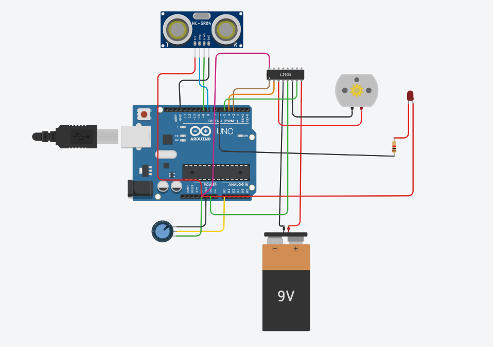

# P5 — Arduino SetSpeed

## Objective
The objective of this problem is to implement the SetSpeed and Updated SetSpeed components on Arduino hardware using physical sensors and actuators. The system must read real-world inputs, compute the SetSpeed logic, drive actuators in real time, and log speed values into PostgreSQL for visualization in Grafana.

## Circuit Diagram

python3 serial_to_postgres.py /dev/ttyUSB0 speed_log_hw

Grafana configuration (local host)

Datasource: PostgreSQL (host localhost, DB postgres, user postgres, password set accordingly).

Recommended panels:

Speed vs Tick:

SELECT tick AS "time", speed FROM speed_log_hw ORDER BY tick;

(If Grafana expects time, you can use ts timestamp column instead.)

cmd vs speed overlay:

SELECT tick, cmd, speed FROM speed_log_hw ORDER BY tick;

Pause overlay (show binary pause):

SELECT tick, pause FROM speed_log_hw ORDER BY tick;

Effective delta:

SELECT tick, effective_delta FROM speed_log_hw ORDER BY tick;

Export PNG snapshots for the report.