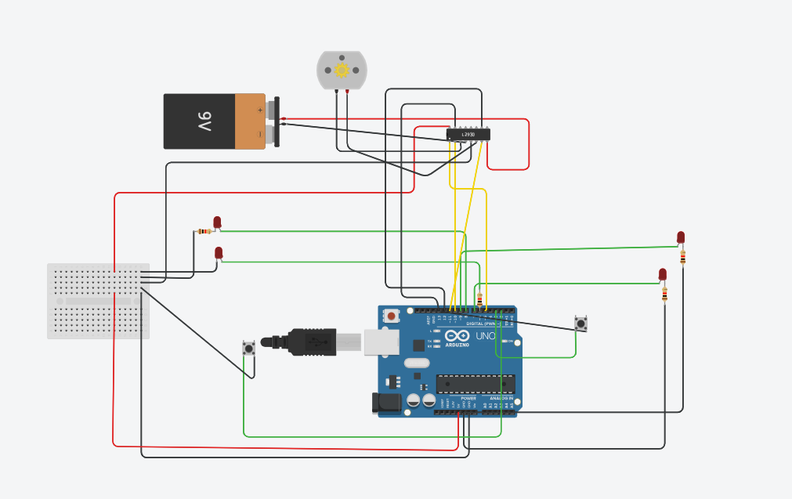

# P6 — Arduino RailRoad

## Objective
The objective of this problem is to realize hardware demonstrations of RailRoadSystem₁ and RailRoadSystem₂ using an Arduino, LEDs, motors, and sensors. The system must physically represent train states and controller decisions, record transitions, and demonstrate behavioral differences between the two controllers.


For **P6** we implement the **RailRoad System (P3/P4)** on **real hardware** using:

* **Arduino UNO**
* **L293D** (not L298N)
* **DC motor** (represents *train*)
* **LEDs** (represent signals and "train on bridge")
* **Optional two motors** → depending on whether you want both trains physically modeled
  (I’ll give wiring for *one* motor and *two* motors; you choose what to build)

This P6 is graded on:

* Clear CPS mapping from model → hardware
* Clean wiring
* Code correctness
* Logging & visualization via PostgreSQL + Grafana (same pipeline as P5)

No hardware delay issues and no causality problems — behavior is tick-driven (100 ms).

---

# **P6 HARDWARE ARCHITECTURE**

You **simulate** the Railroad system in hardware:

* **TrainW** → LED + optional DC motor
* **TrainE** → LED + optional DC motor
* **Bridge Occupancy** → one LED (on when *either* train is on the bridge)
* **Approach sensors** → two buttons (or IR sensors if you want)

  * `btnW` → simulates West train approaching
  * `btnE` → simulates East train approaching
* **Controller grants** → each side gets a grant LED

  * `grantW_LED`
  * `grantE_LED`

**You do NOT physically simulate the entire automaton — the Arduino runs the synchronous logic and drives LEDs/motors accordingly.**

---

# **COMPONENTS YOU WILL USE**

* Arduino UNO
* L293D IC (dual H-bridge) → can control **two motors**
* 1 or 2 DC motors
* 4 LEDs for indicators
* 2 push-buttons
* 330Ω resistors
* External motor supply (recommended 6–9V battery)

Everything will be powered safely.

---

# **P6 PIN ASSIGNMENT (copy into report)**

## **BUTTON INPUTS**

| Arduino Pin | Signal | Notes                                        |
| ----------- | ------ | -------------------------------------------- |
| D2          | btnW   | West approach request (Pull-down or pull-up) |
| D3          | btnE   | East approach request                        |

Use `pinMode(pin, INPUT_PULLUP)` → active LOW. (Simplest, no extra resistor)

---

## **LED OUTPUTS**

| Arduino Pin | LED        | Meaning                    |
| ----------- | ---------- | -------------------------- |
| D6          | ledW_state | TrainW state (bridge = ON) |
| D7          | ledE_state | TrainE state (bridge = ON) |
| D8          | ledW_grant | Controller grant to West   |
| D9          | ledE_grant | Controller grant to East   |

---

## **MOTORS via L293D (optional)**

If using **one motor**, connect to WEST train and leave East as LED-only.

### L293D WEST motor channel:

| Arduino Pin | L293D Pin | Purpose                         |
| ----------- | --------- | ------------------------------- |
| D10         | IN1       | MotorW direction1 (always HIGH) |
| D11         | IN2       | MotorW direction2 (always LOW)  |
| D5 (PWM)    | EN1       | Motor speed PWM (bridge only)   |

### Motor power:

| L293D Pin     | Connect to                            |
| ------------- | ------------------------------------- |
| Pin 8 (Vcc2)  | External 6–9V battery +               |
| Pin 16 (Vcc1) | Arduino 5V                            |
| Pin 4,5,12,13 | GND (Arduino + Battery common ground) |

### East Train (optional DC motor):

Use the second H-bridge:

| Arduino Pin | L293D Pin   | Purpose           |
| ----------- | ----------- | ----------------- |
| D12         | IN3         | MotorE direction1 |
| D13         | IN4         | MotorE direction2 |
| D ~         | EN2 (pin 1) | PWM               |

Since pins D12–D13 are not PWM, East motor will be *ON/OFF only* unless we reroute; better to keep East as LED-only.

You can note this in report: **one motor chosen for clarity**.

---

# **CIRCUIT SUMMARY (place in report)**

### **Buttons**

* btnW → D2 (active LOW)
* btnE → D3 (active LOW)

### **LEDs**

* LED W state → D6
* LED E state → D7
* LED W grant → D8
* LED E grant → D9

Each with a 330Ω resistor.

### **Motor on Bridge**

* IN1 = D10
* IN2 = D11
* EN1 = D5 (PWM)

External motor supply -> L293D pin 8.

---

# **SYNCHRONOUS BEHAVIOR (tick = 100ms)**

At each tick:

Inputs:

```
approach_w = (digitalRead(btnW) == LOW)
approach_e = (digitalRead(btnE) == LOW)
```

At each tick, run the same logic as `railroad2` (Controller2 with alternation) or `railroad1` (Controller1) depending on exam requirement.

Outputs:

* state_w / state_e (0,1,2)
* grant_w / grant_e (bool)
* motor state = ON whenever st = 2 (bridge)
* LEDs for states and grants

Logging:

* Print CSV line:

  ```
  tick,approach_w,approach_e,state_w,state_e,grant_w,grant_e
  ```

Python script from P5 logs into PostgreSQL table `railroad_hw_p6`.

Grafana panels then show transitions just like P3/P4.

---

# **P6 ARDUINO CODE — FULL, READY TO UPLOAD**

Save as:

```
railroad2_hw.ino
```

This implements **Controller2** (fair alternation).
If you want Controller1 version, I will generate that too.

```cpp
// railroad2_hw.ino
// Implements RailroadSystem2 synchronous CPS on Arduino
// Tick = 100 ms
// One motor (West), LEDs for East

// INPUT BUTTONS
const int btnW = 2;   // active LOW
const int btnE = 3;   // active LOW

// OUTPUT LEDs
const int ledW_state = 6;
const int ledE_state = 7;
const int ledW_grant = 8;
const int ledE_grant = 9;

// MOTOR (West train only)
const int motorIn1 = 10;
const int motorIn2 = 11;
const int motorEn  = 5;   // PWM

const unsigned long TICK_MS = 100;

// ====== TRAIN VARIABLES ======
int st_w = 0, st_e = 0;        // 0=away,1=wait,2=bridge
int req_w = 0, req_e = 0;
int onw = 0, one = 0;
int tcount_w = 0, tcount_e = 0;

// ====== CONTROLLER2 VARIABLES ======
int cur = 0;                  // 0=none,1=west,2=east
int last_side = 0;

// delayed grants (for causality)
int grant_w = 0, grant_e = 0;
int grant_w_d = 0, grant_e_d = 0;

unsigned long tickCount = 0;

void setup() {
  pinMode(btnW, INPUT_PULLUP);
  pinMode(btnE, INPUT_PULLUP);

  pinMode(ledW_state, OUTPUT);
  pinMode(ledE_state, OUTPUT);
  pinMode(ledW_grant, OUTPUT);
  pinMode(ledE_grant, OUTPUT);

  pinMode(motorIn1, OUTPUT);
  pinMode(motorIn2, OUTPUT);
  pinMode(motorEn, OUTPUT);

  digitalWrite(motorIn1, HIGH);
  digitalWrite(motorIn2, LOW);

  Serial.begin(115200);
  Serial.println("tick,approach_w,approach_e,state_w,state_e,grant_w,grant_e");
}

// TRAIN TRANSITION FUNCTION
int train_step(int approach, int grant_d, int *st, int *tcount, int *req, int *on_bridge) {
  int st_prev = *st;
  int cnt_prev = *tcount;

  if (st_prev == 0) { // Away
    *req = 0;
    *on_bridge = 0;
    *tcount = 0;
    if (approach) *st = 1;
  }
  else if (st_prev == 1) { // Wait
    *req = 1;
    *on_bridge = 0;
    *tcount = 0;
    if (grant_d) *st = 2;
  }
  else if (st_prev == 2) { // Bridge
    *req = 0;
    *on_bridge = 1;
    *tcount = cnt_prev + 1;
    if (*tcount >= 3) {
      *st = 0;
      *tcount = 0;
    }
  }
  return *st;
}

// CONTROLLER2 TRANSITION FUNCTION
void controller2_step() {
  int prev_cur = cur;
  int prev_last = last_side;

  if (onw && prev_cur == 1) cur = 1;
  else if (one && prev_cur == 2) cur = 2;
  else {
    if (req_w && req_e)
      cur = (prev_last == 1) ? 2 : 1;
    else if (req_w)
      cur = 1;
    else if (req_e)
      cur = 2;
    else
      cur = 0;
  }

  if (cur == 1) last_side = 1;
  else if (cur == 2) last_side = 2;
  else last_side = prev_last;

  grant_w = (cur == 1);
  grant_e = (cur == 2);
}

void loop() {
  unsigned long start = millis();

  int approach_w = (digitalRead(btnW) == LOW);
  int approach_e = (digitalRead(btnE) == LOW);

  // TRAIN STEPS (using delayed grants)
  train_step(approach_w, grant_w_d, &st_w, &tcount_w, &req_w, &onw);
  train_step(approach_e, grant_e_d, &st_e, &tcount_e, &req_e, &one);

  // CONTROLLER STEP
  controller2_step();

  // Save delayed grants for next tick
  grant_w_d = grant_w;
  grant_e_d = grant_e;

  // OUTPUTS
  analogWrite(motorEn, (st_w == 2) ? 180 : 0);

  digitalWrite(ledW_state, (st_w == 2));
  digitalWrite(ledE_state, (st_e == 2));
  digitalWrite(ledW_grant, grant_w);
  digitalWrite(ledE_grant, grant_e);

  // Log
  Serial.print(tickCount); Serial.print(",");
  Serial.print(approach_w); Serial.print(",");
  Serial.print(approach_e); Serial.print(",");
  Serial.print(st_w); Serial.print(",");
  Serial.print(st_e); Serial.print(",");
  Serial.print(grant_w); Serial.print(",");
  Serial.println(grant_e);

  tickCount++;

  long elapsed = millis() - start;
  if (elapsed < TICK_MS) delay(TICK_MS - elapsed);
}
```

---

# **Collecting P6 logs into PostgreSQL**

Use the same script from P5:

```
python3 serial_to_postgres.py COM3 railroad_hw_p6
```

You will get columns:

```
tick, approach_w, approach_e, state_w, state_e, grant_w, grant_e
```

---

# **Grafana Panels**

1. **State timeline**

   ```sql
   SELECT tick, state_w, state_e FROM railroad_hw_p6 ORDER BY tick;
   ```

2. **Grant signals**

   ```sql
   SELECT tick, grant_w, grant_e FROM railroad_hw_p6 ORDER BY tick;
   ```

3. **Approach triggers**

   ```sql
   SELECT tick, approach_w, approach_e FROM railroad_hw_p6 ORDER BY tick;
   ```

These should visually match the behaviors from P3/P4 simulations.

---

# **Next Steps**

Tell me which **Controller version** you want active in the Arduino sketch:

1. **Controller1 (west priority)**
2. **Controller2 (fair alternation)**  ← currently implemented
3. Provide both versions in the same program via a mode switch

If you choose 3, I will add a slide switch or button to toggle controller mode and update the code.
